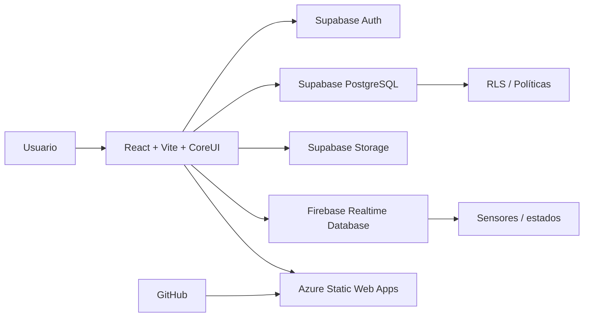
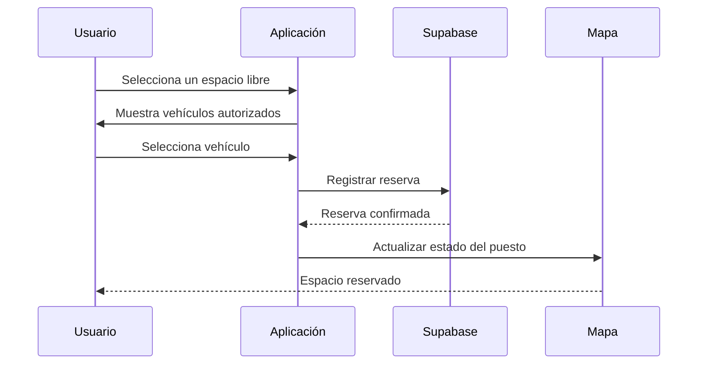

<div align="center">

# 🅿️ UTEQ Smart Parking

### Gestión inteligente de vehículos, propietarios, puestos y reservas

[](https://react.dev/)
[](https://vitejs.dev/)
[](https://coreui.io/)
[](https://supabase.com/)
[](https://firebase.google.com/)
[](https://azure.microsoft.com/)

**Aplicación web para administrar un parqueadero inteligente de 80 espacios, con control de vehículos y propietarios, autenticación por roles, reservas, sensores en tiempo real e historial de operaciones.**

</div>

---

## 📌 Descripción

**UTEQ Smart Parking** es una aplicación web orientada a la administración de un parqueadero inteligente. El sistema centraliza la información de **vehículos, propietarios, cuentas, puestos y reservas**, y combina los datos administrativos de **Supabase** con las lecturas de sensores almacenadas en **Firebase Realtime Database**.

La interfaz utiliza **React, Vite y CoreUI**, con navegación protegida por autenticación y dos niveles principales de acceso: **usuario normal** y **administrador**. El despliegue se realiza mediante **Azure Static Web Apps** y el repositorio mantiene el flujo de integración a través de GitHub.

---

## ✨ Vista general

<p align="center">
  
</p>

El menú principal adapta las opciones según el rol autenticado. La vista administrativa habilita herramientas de gestión, mientras que el usuario normal conserva acceso únicamente a las funciones asociadas a su cuenta y sus vehículos.

---

## 🚦 Disponibilidad del parqueadero

<p align="center">
  
</p>

El parqueadero está organizado en **80 espacios**, distribuidos en cuatro columnas:

```text
A01 ... A20
B01 ... B20
C01 ... C20
D01 ... D20
```

Cada puesto puede representar estados como:

- 🟢 **Libre**
- 🔴 **Ocupado**
- 🟠 **Reservado**
- ⚪ **Sin datos / lectura no vigente**

La vista de disponibilidad permite filtrar por estado y columna.

---

## 🗺️ Mapa interactivo

<p align="center">
  
</p>

El mapa visual representa los 80 espacios sobre una imagen personalizada del estacionamiento. Al seleccionar un puesto se puede consultar información como:

- código del espacio;
- sensor asociado;
- estado operativo;
- distancia detectada;
- última actualización;
- vehículo vinculado;
- información de la reserva, cuando corresponda.

---

## 🚗 Vehículos y propietarios

<p align="center">
  
</p>

El módulo principal implementa un **CRUD completo** para vehículos y propietarios.

### Operaciones disponibles

- ✅ Listar registros.
- 🔎 Buscar por placa, vehículo o propietario.
- 📄 Paginar resultados.
- ➕ Agregar un nuevo vehículo.
- ✏️ Editar información existente.
- 🗑️ Eliminar con confirmación.
- 🖼️ Gestionar fotografía del vehículo.
- 👤 Mostrar fotografía del propietario.
- ✅ Autorizar o controlar el estado del vehículo.
- 🔄 Actualizar la tabla sin recargar toda la página.

### Validaciones

El formulario comprueba los campos antes de guardar, incluyendo:

- formato de placa;
- correo válido;
- cédula de 10 dígitos;
- año permitido;
- marca;
- modelo;
- color;
- campos obligatorios;
- imágenes requeridas según el tipo de operación.

Durante las operaciones se muestran **indicadores de carga, mensajes de éxito/error y botones deshabilitados temporalmente** para evitar acciones duplicadas.

---

## 🅿️ Gestión de puestos

<p align="center">
  
</p>

La sección de puestos ofrece una vista administrativa de los 80 espacios con información consolidada:

| Dato | Descripción |
|---|---|
| Puesto | Código de integración, por ejemplo `A01` |
| Sensor | Identificador del sensor asociado |
| Estado | Libre, ocupado, reservado o sin datos |
| Distancia | Lectura recibida desde el sensor |
| Vehículo | Vehículo relacionado con el espacio |
| Propietario | Cuenta o propietario relacionado |
| Integración | Estado de la relación entre sistemas |
| Acción | Acceso al detalle del puesto |

---

## 👥 Propietarios y cuentas

<p align="center">
  
</p>

La aplicación distingue entre dos conceptos:

### Propietario histórico

Persona presente en los registros de vehículos, pero sin una cuenta autenticada vinculada al sistema.

### Cuenta registrada

Usuario que dispone de una cuenta de autenticación y puede acceder a las funciones habilitadas para su perfil.

El administrador puede consultar:

- total de propietarios;
- propietarios con cuenta;
- propietarios sin cuenta;
- vehículos pendientes;
- placas relacionadas;
- estado de la cuenta.

---

## 🕘 Historial general

<p align="center">
  
</p>

El historial mantiene trazabilidad de eventos asociados al parqueadero.

### Administrador

Puede consultar el historial general de sensores y reservas de los 80 puestos.

### Usuario normal

Solo puede consultar los eventos relacionados con su propia cuenta, sus vehículos y sus reservas.

Esta separación se aplica mediante control de rol y políticas de seguridad en Supabase.

---

## 🔐 Inicio de sesión

<p align="center">
  
</p>

El sistema incorpora autenticación para proteger las rutas privadas de la aplicación.

Funciones disponibles:

- acceso con correo y contraseña;
- creación de cuenta;
- recuperación de sesión al refrescar la página;
- cierre de sesión;
- acceso mediante proveedor externo cuando se encuentre configurado;
- redirección según estado de autenticación.

---

## 👤 Perfil del usuario

<p align="center">
  
</p>

Cada cuenta dispone de un área personal para consultar y actualizar información autorizada, incluyendo:

- nombre;
- cédula;
- fotografía de perfil;
- información vinculada a la cuenta;
- vehículos asociados.

> Las capturas publicadas en este README han sido preparadas para ocultar datos personales sensibles.

---

# 🧩 Arquitectura



### Responsabilidad de cada servicio

| Componente | Responsabilidad |
|---|---|
| **React + Vite** | Interfaz y navegación |
| **CoreUI** | Componentes visuales y diseño responsivo |
| **Supabase Auth** | Autenticación y sesión |
| **Supabase PostgreSQL** | Vehículos, perfiles, puestos, reservas e historial |
| **Supabase RLS** | Restricciones de acceso por usuario/rol |
| **Supabase Storage** | Fotografías de perfil y vehículos |
| **Supabase Realtime** | Actualizaciones relacionadas con reservas e historial |
| **Firebase RTDB** | Lecturas de sensores y estados físicos |
| **Azure Static Web Apps** | Publicación de la aplicación |
| **GitHub Actions** | Automatización del despliegue |

---

# 🛡️ Roles y permisos

| Función | Usuario normal | Administrador |
|---|:---:|:---:|
| Iniciar sesión | ✅ | ✅ |
| Consultar disponibilidad | ✅ | ✅ |
| Consultar mapa | ✅ | ✅ |
| Editar perfil propio | ✅ | ✅ |
| Gestionar vehículos propios | ✅ | ✅ |
| Reservar un espacio | ✅ | ✅ |
| Consultar historial propio | ✅ | ✅ |
| Ver todos los vehículos/propietarios | Lectura según reglas | ✅ |
| Crear/editar registros administrativos | ❌ | ✅ |
| Eliminar registros | ❌ | ✅ |
| Gestionar puestos | ❌ | ✅ |
| Consultar historial global | ❌ | ✅ |
| Gestionar propietarios/cuentas | ❌ | ✅ |

---

# 🔄 Flujo de una reserva



Firebase continúa representando la **lectura física del sensor**, mientras que Supabase conserva la relación administrativa de la reserva y del vehículo seleccionado.

---

# 🗃️ Base de datos y seguridad

El proyecto utiliza scripts SQL versionados dentro de la carpeta `sql/`.

```text
sql/
├── 002_crud_vehiculos_rls.sql
├── 003_roles_admin_usuario.sql
├── 004_vincular_cuentas_vehiculos.sql
├── 005_conectar_puestos_vehiculos.sql
├── 006_perfiles_y_registro_usuario.sql
├── 007_reservas_puestos.sql
├── 008_historial_reservas.sql
└── 009_seguridad_historial.sql
```

Entre las reglas de seguridad se incluyen:

- Row Level Security habilitado;
- lectura controlada;
- operaciones administrativas restringidas;
- edición de información propia;
- protección del historial;
- separación entre historial global y propio;
- restricciones para reservas;
- vinculación de cuentas con vehículos.

---

# 📁 Estructura actual

```text
Parqueadero-Inteligente/
│
├── .github/
├── public/
├── scripts/
├── sql/
│
├── src/
│   ├── components/
│   ├── context/
│   ├── hooks/
│   ├── lib/
│   ├── pages/
│   ├── services/
│   ├── views/
│   │   ├── cuenta/
│   │   └── parqueadero/
│   │
│   ├── App.jsx
│   ├── App.css
│   ├── login.css
│   ├── main.jsx
│   └── tema-claro.css
│
├── index.html
├── package.json
├── package-lock.json
├── README.md
└── vite.config.js
```

---

# ⚙️ Instalación

## Requisitos

- Node.js 18 o superior.
- npm.
- Proyecto de Supabase configurado.
- Proyecto de Firebase configurado.

## Clonar

```bash
git clone https://github.com/KEVINANNB/Parqueadero-Inteligente.git
cd Parqueadero-Inteligente
```

## Instalar dependencias

```bash
npm install
```

## Variables de entorno

Crear un archivo `.env` con las variables utilizadas por la aplicación.

```env
VITE_SUPABASE_URL=
VITE_SUPABASE_ANON_KEY=

VITE_FIREBASE_API_KEY=
VITE_FIREBASE_AUTH_DOMAIN=
VITE_FIREBASE_DATABASE_URL=
VITE_FIREBASE_PROJECT_ID=
VITE_FIREBASE_STORAGE_BUCKET=
VITE_FIREBASE_MESSAGING_SENDER_ID=
VITE_FIREBASE_APP_ID=
```

> **Nunca publiques valores reales de claves o secretos en GitHub.**

## Desarrollo

```bash
npm run dev
```

## Build

```bash
npm run build
```

## Vista previa

```bash
npm run preview
```

---

# ☁️ Despliegue

La aplicación puede desplegarse con el siguiente flujo:

```text
VS Code
   ↓
Git
   ↓
GitHub / main
   ↓
GitHub Actions
   ↓
Vite build
   ↓
Azure Static Web Apps
```

---

# ✅ Funciones implementadas

- [x] Autenticación.
- [x] Roles de usuario y administrador.
- [x] CRUD de vehículos y propietarios.
- [x] Búsqueda.
- [x] Paginación.
- [x] Validaciones.
- [x] Mensajes de éxito y error.
- [x] Confirmación antes de eliminar.
- [x] Fotografías de propietarios y vehículos.
- [x] Supabase Storage.
- [x] Políticas RLS.
- [x] 80 puestos.
- [x] Integración con sensores.
- [x] Mapa visual interactivo.
- [x] Reservas vinculadas a vehículos.
- [x] Historial de reservas.
- [x] Historial administrativo.
- [x] Historial privado por usuario.
- [x] Diseño responsivo.
- [x] Persistencia de sesión al refrescar rutas protegidas.
- [x] Despliegue en Azure Static Web Apps.

---

# 🎓 Contexto académico

Proyecto desarrollado para la **Universidad Técnica Estatal de Quevedo (UTEQ)** como aplicación de gestión para un parqueadero inteligente, integrando servicios web, autenticación, bases de datos, seguridad, almacenamiento, tiempo real y despliegue en la nube.

---

<div align="center">

### UTEQ Smart Parking

**80 espacios · vehículos · propietarios · reservas · sensores · seguridad**

</div>
